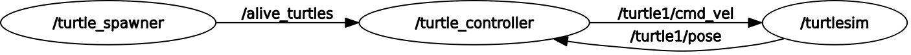

# Projeto Final ROS 2 — *Turtlesim Catch Them All*

Este projeto foi desenvolvido como parte do curso **ROS 2 for Beginners**, do professor **Edouard Renard**.  
O objetivo é criar uma aplicação completa em ROS 2 que simula um robô “caçador de tartarugas” usando o pacote `turtlesim`.  
O sistema é composto por múltiplos *nodes* que se comunicam entre si via *topics* e *services*, aplicando conceitos fundamentais de ROS como controle, comunicação e gerenciamento de parâmetros.

---

## Estrutura do Projeto

O projeto possui três componentes principais:

1. **Turtle Spawner Node (`turtle_spawner_node.cpp`)** — responsável por gerar e remover tartarugas no ambiente.
2. **Turtle Controller Node (`turtle_controller_node.cpp`)** — controla a tartaruga principal (`turtle1`), aplicando um controlador proporcional (P) para perseguir e capturar outras tartarugas.
3. **Launch File (`finalProject.launch.xml`)** — inicializa todos os nós, define parâmetros e organiza a execução do sistema.



---

## 1. Turtle Spawner Node
**Arquivo:** `turtle_spawner_node.cpp`

Este nó é responsável por criar novas tartarugas em posições aleatórias dentro da janela do *turtlesim* e publicar uma lista com todas as que estão “vivas” no momento.

### Principais funcionalidades:
- **Geração aleatória de coordenadas:** usa geradores pseudoaleatórios (`std::mt19937`) para definir a posição e orientação de cada nova tartaruga.
- **Serviços ROS integrados:**
  - `/spawn` — cria uma nova tartaruga.
  - `/kill` — remove uma tartaruga específica.
- **Tópico publicado:** `alive_turtles` (tipo `TurtleArray`), que contém o nome e coordenadas de todas as tartarugas ativas.
- **Serviço customizado:** `catch_turtle`, que remove uma tartaruga capturada pelo controlador.

### Fluxo resumido:
1. A cada intervalo definido em `spawn_time`, o nó cria uma nova tartaruga.  
2. Cada tartaruga é armazenada em um vetor `alive_turtles_` e publicada no tópico.  
3. Quando o *controller* comunica que uma tartaruga foi capturada, o *spawner* a remove do vetor e publica o estado atualizado.  

Esse nó é a “fonte” do ecossistema: ele cria os alvos e mantém a lista de quais ainda estão vivas.

---

## 2. Turtle Controller Node
**Arquivo:** `turtle_controller_node.cpp`

O *controller* é o cérebro do sistema. Ele controla a tartaruga principal (`turtle1`) para perseguir as outras tartarugas no ambiente.

### Principais conceitos aplicados:
- **Assinaturas:**
  - `alive_turtles` — recebe as posições das tartarugas ativas.
  - `turtle1/pose` — monitora a posição atual da tartaruga controlada.
- **Publicação:**
  - `turtle1/cmd_vel` — envia comandos de velocidade linear e angular.
- **Serviço cliente:**
  - `catch_turtle` — requisita a remoção de uma tartaruga capturada.

### Lógica de controle:
1. O nó lê a posição de todas as tartarugas vivas.  
2. Calcula qual está mais próxima usando distância euclidiana.  
3. Usa um **controlador proporcional (P)** para ajustar:
   - Velocidade linear → proporcional à distância.
   - Velocidade angular → proporcional ao erro de orientação.  
4. Quando a distância é menor que um limiar (0.5), o nó chama o serviço `catch_turtle` para “matar” a tartaruga capturada.

O comportamento emergente é uma tartaruga que caça automaticamente as outras, uma a uma, até não restar nenhuma.

---

## 3. Launch File
**Arquivo:** `finalProject.launch.xml`

O arquivo de *launch* automatiza toda a execução do sistema.  
Ele inicializa o `turtlesim_node`, o `turtle_spawner` e o `turtle_controller`, aplicando parâmetros ajustáveis para experimentação.

```xml
<launch>
    <node pkg="turtlesim" exec="turtlesim_node"/>
    <node pkg="turtlesim_catch_them_all" exec="turtle_spawner">
        <param name="spawn_time" value="1.5"/>
    </node>
    <node pkg="turtlesim_catch_them_all" exec="turtle_controller">
        <param name="linear_velocity" value="1.25"/>
        <param name="angular_velocity" value="1.8"/>
    </node>
</launch>
```

### Parâmetros principais:
- `spawn_time`: intervalo de tempo entre o surgimento de novas tartarugas.  
- `linear_velocity` e `angular_velocity`: ganhos do controlador proporcional (P).

---

## Conceitos Reforçados
- Estrutura de *nodes* em ROS 2  
- Comunicação por *topics* e *services*  
- Customização de mensagens (`Turtle.msg`, `TurtleArray.msg`) e serviços (`CatchTurtle.srv`)  
- Uso de parâmetros para modularidade  
- Controle proporcional aplicado a movimento em 2D  

---

## 🏁 Conclusão

Esse projeto sintetiza de forma prática os fundamentos do ROS 2: comunicação, modularidade e controle.  
Ver as tartarugas interagindo em tempo real, com o *controller* tomando decisões a partir de dados publicados por outro nó, é uma demonstração clara do poder do ROS.  

Próximos passos: explorar **simulações 3D** e integração com **robôs reais**.

---

*Projeto baseado no curso “ROS 2 for Beginners”, de Edouard Renard.*
